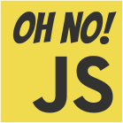

# About
JS functions' library that makes JS syntax easier.

# Install
```shell
npm install oh-no-js
#or
yarn add oh-no-js
```

## Dev/Test
```shell
yarn run test
#or
npm run test
```

## Getting started
Import functions you need:
```javascript
import { objEqual, nuPi } from 'on-no-js';
```

Use them. For more information open [TODOdocumentationLINK](documentationLink)
```javascript
const obj1 = { name: { first: 'Paul', second: 'Johnson' } };
const obj2 = { name: { first: 'Paul', second: 'Johnson' } };

const areEqual = objEqual(obj1, obj2); // excepted true
```

```javascript
const obj = {};

// NUllish coalescing PIpe
nuPi(obj, 'prop1.prop2').prop3 = 'Hello!';

// Expected:
// obj === { prop1: { prop2: { prop3: 'Hello!' } } };
```